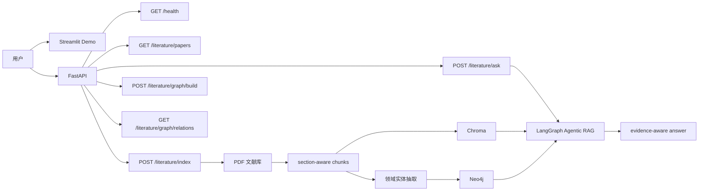

# Research Copilot 文献库问答系统

Research Copilot 是一个面向 PDF 文献库的 Agentic RAG 问答系统。项目重点是把“文献库 manifest 管理、PDF 解析、section-aware chunking、Chroma 混合检索、Neo4j 知识图谱、结构化回答、evidence 引用校验、Streamlit 展示和测试”串成一个可复现的 AI 应用工程闭环。

> 本公开仓库不包含论文 PDF/DOCX 全文、上传文件或本地生成的向量数据库。`data/literature_corpus/` 仅保留 manifest、元数据、下载目标说明和复现脚本；请在确认拥有合法访问与使用权限后自行准备文献全文。

## 项目背景

科研文献问答常见问题是：模型容易脱离原文编造结论，检索结果缺少来源追踪，跨论文比较困难，材料、方法、力场、软件、性质之间的关系不清楚。本项目用 evidence-based answering 约束回答，并引入 Neo4j 知识图谱作为增强层：

- Chroma 负责检索原文 evidence chunks。
- Neo4j 负责查询 Paper -> Material/Method/ForceField/Software/Property/Finding 的结构化关系。
- 回答结果保留 evidence、citation alignment 和 Agent trace，便于复查。

## 核心能力

- 文献库管理：读取 `data/literature_corpus/metadata/` 下的 manifest，正式知识库只索引已有 PDF。
- PDF 解析与切分：抽取 PDF 文本，按 Abstract、Methods、Results、Conclusion 等 section 切分 evidence chunks。
- 混合检索：结合 Chroma 向量检索和关键词检索，提升专业术语如 `RDX`、`HTPB`、`ReaxFF` 的召回稳定性。
- Agentic RAG：显式拆成 question analysis、query planning、hybrid retrieval、KG retrieval、evidence fusion、answer generation、citation verification。
- 知识图谱：从 PDF chunk 中规则抽取材料、方法、力场、软件、性质和发现，写入 Neo4j，并支持关系路径搜索。
- 可视化 Demo：Streamlit 页面提供文献库概览、文献问答、知识图谱构建和实体关系搜索。
- 工程兜底：Neo4j 不可用时文本 RAG 仍可运行；API 使用统一 `ApiResponse`。

## 系统架构



## 项目结构

```text
app/                  FastAPI 服务入口
core/                 文档加载、切分、检索、索引、图谱、响应封装
schemas/              API 响应结构、文献回答结构、图谱抽取结构
workflows/            LangGraph 工作流编排
demo/                 Streamlit 本地 Demo
data/literature_corpus/ manifest 元数据与语料准备说明（论文全文需自行准备）
docs/                 环境、Demo、评测和学习文档
scripts/              下载、评测和调试脚本
tests/                pytest 单元测试和接口契约测试
```

## 快速开始

### 1. 创建环境

```bash
python -m venv .venv
.venv\Scripts\activate
python -m pip install -r requirements.txt
```

### 2. 配置模型和 Neo4j

复制 `.env.example` 为 `.env`，按需填写：

```env
DASHSCOPE_API_KEY=your_api_key_here
OPENAI_BASE_URL=https://dashscope.aliyuncs.com/compatible-mode/v1
OPENAI_MODEL=qwen3.7-plus-2026-05-26
GROUNDEDNESS_MODEL=qwen3.7-plus-2026-05-26
NEO4J_URI=bolt://localhost:7687
NEO4J_USERNAME=neo4j
NEO4J_PASSWORD=password
```

Neo4j 可用 Docker 启动：

```bash
docker run --name em-neo4j -p 7474:7474 -p 7687:7687 -e NEO4J_AUTH=neo4j/password neo4j:5
```

Neo4j 是增强层；没有启动时，文本 RAG 仍可运行。

### 3. 启动 FastAPI

```bash
uvicorn app.main:app --reload
```

Swagger 地址：`http://127.0.0.1:8000/docs`。

### 4. 启动 Streamlit Demo

```bash
streamlit run demo/streamlit_app.py
```

打开 `http://localhost:8501`，按顺序使用：

1. 在“文献库概览”中构建 PDF 文献库索引。
2. 在“知识图谱”中构建/更新 Neo4j 图谱，并搜索 `RDX`、`ReaxFF` 等实体关系。
3. 在“文献问答”中提问，查看回答、对比表、evidence、KG 命中和 Agent trace。

## API 响应约定

### `GET /health`

```json
{
  "status": "ok"
}
```

### `GET /literature/papers`

读取文献库清单，返回候选论文、可入库 PDF 统计和论文 metadata。

### `POST /literature/index`

请求体示例：

```json
{
  "max_papers": null,
  "build_graph": false,
  "collection_name": "energetic_materials_literature"
}
```

作用：解析已有 PDF，按 section 切分 chunk，写入 Chroma。`build_graph=true` 时同步构建 Neo4j 图谱。

### `POST /literature/ask`

请求体示例：

```json
{
  "query": "哪些论文涉及 RDX/HTPB 热分解，它们使用了哪些模拟方法？",
  "collection_name": "energetic_materials_literature"
}
```

响应中的 `data.final_output` 包含：

- `summary`
- `comparison_table`
- `mechanisms`
- `methods`
- `findings`
- `limitations`
- `evidence`
- `kg_context`

### `POST /literature/graph/build`

从已有 PDF chunk 抽取实体和关系，写入 Neo4j。

### `GET /literature/graph/entities`

读取 Neo4j 中 Paper、Material、Method、ForceField、Software、Property、Finding 的实体数量。

### `GET /literature/graph/relations`

示例：

```text
GET /literature/graph/relations?term=ReaxFF&limit=25
```

返回 Paper -> Entity 的关系路径，例如：

```text
(Paper: P1) -[:USES_FORCE_FIELD]-> (ForceField: ReaxFF)
```

## 普通 RAG 和知识图谱的区别

普通 RAG 从 Chroma 检索相似原文片段，适合回答“原文怎么说”。知识图谱把论文中的材料、方法、力场、软件、性质、发现抽成节点和关系，适合回答“哪些论文研究了什么、用了什么方法、报告了什么性质”。

本项目中二者是协作关系，不是替代关系：Chroma 找原文证据，Neo4j 找实体关系。

## 测试

```bash
python -m pytest -q
```

当前测试覆盖文本切分、检索结果格式化、schema 解析、引用校验、统一响应结构、文献库 manifest、混合检索、知识图谱契约和 workflow 错误兜底。

## Embedding provider与检索评测

项目支持显式选择两种向量后端：

- `local_hash`：64维离线hash向量，用于无网络演示与测试。
- `dashscope`：通过OpenAI兼容接口调用 `text-embedding-v4`，默认1024维。

两种provider自动使用不同的Chroma collection；云端失败时不会静默降级。配置见 `.env.example`。

运行paper-level检索评测：

```bash
python scripts/compare_embedding_retrieval.py --providers local_hash dashscope
```

评测输出Hit@5、Recall@5、MRR@5、平均检索耗时和失败原因。

## 已知局限

- 当前 embedding 是本地 hash embedding，便于离线演示，但语义检索能力有限。
- 文献库回答生成仍偏规则式，后续可以接入专用 LLM prompt + schema。
- 图谱抽取是规则式实体抽取，不是完整语义抽取。
- citation alignment 能检查引用 id 和轻量文本支撑，但还不是完整语义蕴含判断。

## 简历表达建议

可概括为：面向实验室含能材料MD文献阅读、检索和证据追溯效率低的问题，构建 PDF 文献库 Agentic RAG 问答系统，基于 FastAPI、Chroma、BM25、LangGraph、Neo4j、Pydantic 和 Streamlit，打通 manifest 批量入库、section-aware chunking、混合检索、结构化回答、evidence 引用校验、Agent trace、知识图谱构建和关系查询。

可写入简历的量化结果：

- 在132条自建可回答问题上完成8组检索消融；`text-embedding-v4`单路向量Hit@5为1.0000、Recall@5为0.9735，混合BM25后Recall@5为0.9848。
- 接入百炼`qwen3-rerank`并完成对照；在local_hash弱召回链路上，Hit@5从0.5455提升至0.8409，MRR@5从0.2777提升至0.8182。
- 基于`qwen3.7-plus-2026-05-26`完成100条Groundedness A/B；KG关闭组Claim Support为0.8346、加权支持率0.9032、Citation Precision为1.0000、Judge失败0。
- 完成Neo4j on/off A/B评测，发现当前KG注入未提升端到端Groundedness，并据此将下一步优化方向定位为KG上下文过滤、按问题类型启用和证据同源约束。

## 百炼云端 Reranker

文献问答默认在向量检索与 BM25 融合去重后，将 30 个候选片段发送给
百炼 `qwen3-rerank`，重排后取 Top 6 进入答案生成。云端重排是显式
provider，缺少 Key、URL 配置错误、限流或欠费时直接返回错误，不会静默
使用原混合检索顺序。

```env
RERANKER_PROVIDER=dashscope
RERANK_MODEL=qwen3-rerank
DASHSCOPE_RERANK_BASE_URL=https://YOUR_WORKSPACE_ID.cn-beijing.maas.aliyuncs.com/compatible-api/v1
RERANK_CANDIDATE_K=30
RERANK_TIMEOUT_SECONDS=30
```

调用 `/literature/ask` 时可显式开启或关闭，用于线上运行和 A/B 评测：

```json
{
  "query": "RDX 热分解研究使用了哪些模拟方法？",
  "embedding_provider": "local_hash",
  "reranker_provider": "dashscope",
  "kg_provider": "neo4j"
}
```

对比有/无 Reranker：

```bash
python scripts/compare_embedding_retrieval.py \
  --providers local_hash \
  --reranker-providers none dashscope \
  --skip-index
```

该命令会将候选文献片段上传到百炼。仅应对允许发送到云端的语料运行；
测试代码使用 fake HTTP client，不会消耗配额或上传本地文献。

### 100 条检索与 Groundedness 评测

生成/刷新证据锚定数据集：

```bash
python scripts/build_rag_eval_dataset.py --cloud-resolve
```

运行检索 A/B、回答生成和语义 Groundedness：

```bash
python scripts/run_rag_benchmark.py \
  --reranker-providers dashscope \
  --run-generation \
  --generation-model qwen3.7-plus-2026-05-26 \
  --judge-model qwen3.7-plus-2026-05-26
```

当前 132 条可回答问题的真实检索结果：无重排 / 百炼重排的 Hit@5 为
0.5455 / 0.8409，Recall@5 为 0.4356 / 0.7689，MRR@5 为
0.2777 / 0.8182，nDCG@5 为 0.2856 / 0.7675；平均延迟为
289.42 / 1322.79 ms。详见 `docs/eval/rag_eval_report_20260825.md`。

同一 100 条数据集的端到端结果：Claim Support Rate 0.8346、加权支持率
0.7997、Citation Coverage 0.9745、Citation Precision 1.0000、Answer
Correctness 0.6280、拒答准确率 1.0000，Judge 失败 0。生成与 Judge 均使用
`qwen3.7-max-2026-06-08`；详见评测报告中的口径和使用边界。

### 完整检索消融

在同一132条可回答问题上运行BM25、向量、混合、混合加Reranker，并分别使用
本地Hash和`text-embedding-v4`：

```bash
python scripts/run_retrieval_ablation.py \
  --embedding-providers local_hash dashscope \
  --strategies bm25 vector hybrid hybrid_rerank
```

当前结果显示`text-embedding-v4`单路向量的Hit@5为1.0000、Recall@5为
0.9735；加入BM25后Recall@5为0.9848，但延迟约翻倍；继续加入Reranker并未
提升强Embedding基线。完整8组结果、失败口径和使用边界见
`docs/eval/retrieval_ablation_report_20260825.md`。

### Neo4j on/off Groundedness A/B

工作流支持显式`kg_provider=none/neo4j`。A/B脚本先检索一次并冻结文本证据，
两组只切换图谱开关；Neo4j连接失败会显式记为失败，不会当作关闭组：

```bash
python scripts/run_kg_groundedness_ab.py \
  --embedding-provider dashscope \
  --reranker-provider none \
  --generation-model qwen3.7-plus-2026-05-26 \
  --judge-model qwen3.7-plus-2026-05-26 \
  --checkpoint app_data/eval/kg_ab_qwen37_plus_full50_checkpoint.json \
  --question-workers 2
```

长任务中断后使用相同参数并增加`--resume`。如果因限流、欠费或网络失败，修复
外部原因后同时增加`--retry-failures`，脚本会删除失败题的两条A/B记录并成对
重跑。Checkpoint保存每题两组完整结果，配置或题目ID不一致时拒绝续跑。

### 独立盲测与实验室试用

盲测由实验室出题人和标注人分别填写`docs/eval/blind_questions.csv`与
`docs/eval/blind_gold.csv`，至少30题，完成证据复核后冻结：

```bash
python scripts/freeze_blind_eval.py
```

冻结文件使用SHA-256命名且禁止覆盖，详细角色隔离规则见
`docs/eval/blind_eval_protocol.md`。真实实验室试用使用
`docs/pilot/lab_pilot_sessions.csv`记录匿名会话，汇总命令为：

```bash
python scripts/summarize_lab_pilot.py
```

空表只生成“没有真实参与者数据”，不会产生成功率或满意度。

### Neo4j Graph 独立评测

在 Neo4j 已构建后生成20条带关系证据的独立graph问题，并运行本地检索基准：

```bash
python scripts/build_graph_eval_dataset.py
python scripts/run_graph_benchmark.py
```

在同一清洗图谱和20条问题上，legacy英文规则＋逐词Top8并集的宏平均F1为
0.4093、Exact Match为0.1000；加入中英文最长匹配和共享Paper的AND交集后，
F1与Exact Match均为1.0000，平均查询延迟17.10 ms。该结果只代表自建受控
关系集上的结构化KG检索，不代表端到端问答准确率；详见
`docs/eval/graph_eval_report_20260825.md`。
