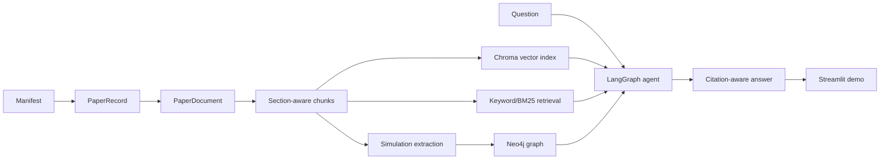

# Energetic Materials Simulation Copilot 学习路线

本项目当前聚焦 PDF 文献库 Agentic RAG 和 Neo4j 知识图谱。学习时不要先背技术名词，按数据流理解：



## 阶段 1：Corpus 管理层

核心文件：

- `core/literature_manifest.py`

要理解的问题：

- 为什么论文知识库需要 `paper_id`，不能只用文件名？
- 为什么 manifest 可以记录 metadata-only 候选论文，但正式 RAG 只索引已有 PDF？
- DOI、topic tags 和 ingestion priority 分别服务什么后续能力？

验证方式：

```bash
python -m pytest tests/test_literature_manifest.py -q
```

## 阶段 2：Section-aware Chunking

核心文件：

- `core/paper_loader.py`
- `core/section_splitter.py`

要理解的问题：

- 普通 chunk 为什么会把 Methods 和 Results 混在一起？
- `section` metadata 如何帮助后续问“用了什么方法”？

验证方式：

```bash
python -m pytest tests/test_section_splitter.py -q
```

## 阶段 3：Hybrid Retrieval

核心文件：

- `core/keyword_retriever.py`
- `core/hybrid_retriever.py`
- `core/literature_indexer.py`

要理解的问题：

- 为什么 `ReaxFF`、`HTPB`、`CL-20` 这类术语更适合关键词检索？
- 为什么向量检索仍然需要保留？

## 阶段 4：领域抽取

核心文件：

- `schemas/simulation_extraction.py`
- `core/simulation_extractor.py`

要理解的问题：

- 信息抽取和问答有什么区别？
- 为什么抽取结果必须保留 evidence chunk？

## 阶段 5：Neo4j 图谱

核心文件：

- `core/graph_store.py`
- `core/kg_retriever.py`

本地 Docker 示例：

```bash
docker run --name em-neo4j -p 7474:7474 -p 7687:7687 -e NEO4J_AUTH=neo4j/password neo4j:5
```

图谱不可用时，系统仍能运行文本检索和 Agentic RAG；图谱是增强层，不是单点依赖。

## 阶段 6：Agentic RAG

核心文件：

- `workflows/literature_agent_workflow.py`

要理解的问题：

- Agentic RAG 的价值不是“自动乱跑”，而是显式拆成 question analysis、query planning、retrieval、fusion、verification。
- trace 是面试展示的关键，因为它能说明系统如何得到答案。

## 阶段 7：Streamlit Demo 与运行命令

核心文件：

- `demo/streamlit_app.py`
- `app/main.py`

要理解的问题：

- “构建/更新 PDF 文献库索引”具体执行了哪些步骤？
- “构建/更新知识图谱”具体抽取了哪些实体和关系？
- 为什么“仅索引前 N 篇 PDF”只能放在学习模式，而不能作为正式默认？

运行方式：

```bash
python -m streamlit run demo/streamlit_app.py --server.port 8501 --server.address localhost
```

如果 8501 被占用，改用 8502：

```bash
python -m streamlit run demo/streamlit_app.py --server.port 8502 --server.address localhost
```
